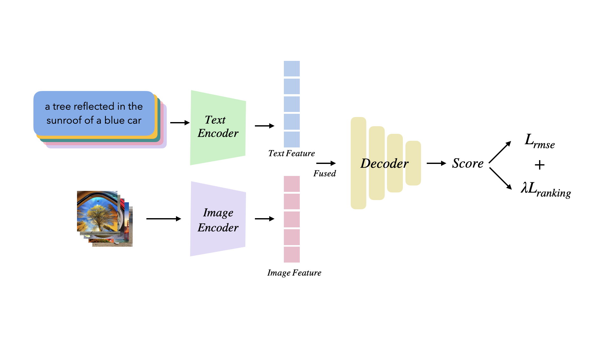

# CLIP-IQA Description
This is the IQA project of class CS3324 in SJTU. And the whole project is implemented base on the structure of [CLIP](https://github.com/openai/CLIP), and I truly thanks for their contribution. 


## Approach




## Installation
Following the instuction on [CLIP](https://github.com/openai/CLIP) will help to install all the dependencies. After installation, you can run the following codes to check whether the installation has been successful. 

```python
import torch
import clip
from PIL import Image

device = "cuda" if torch.cuda.is_available() else "cpu"
model, preprocess = clip.load("ViT-B/32", device=device)

image = preprocess(Image.open("CLIP.png")).unsqueeze(0).to(device)
text = clip.tokenize(["a diagram", "a dog", "a cat"]).to(device)

with torch.no_grad():
    image_features = model.encode_image(image)
    text_features = model.encode_text(text)
    
    logits_per_image, logits_per_text = model(image, text)
    probs = logits_per_image.softmax(dim=-1).cpu().numpy()

print("Label probs:", probs)  # prints: [[0.9927937  0.00421068 0.00299572]]
```

## Dataset
In this project, Two datasets have been used: AGIQA-3K, AIGCIQA2023. This two datasets can be obtained by attach these two links:
[AGIQA-3K](https://github.com/lcysyzxdxc/AGIQA-3k-Database)  
[AIGCIQA2023](https://github.com/wangjiarui153/AIGCIQA2023)  
After downloading, just simply put them into file CLIP-IQA will be fine, or you can put them into anywhere and change the path of dataset in ```cfg.yml```. 

## Usage
For training, run ```python main.py```.  
For testing, run ```python main.py --mode test```.  
More changing details can refer to ```cfg.yml```  
if you write your onw config file, please use ```--cfg``` to change the path when running ```python main.py```.
